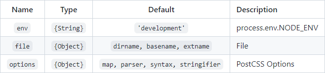
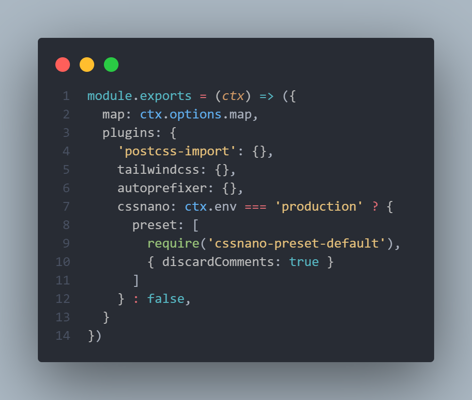

# [**TailwindCSS**](tailwindcss.com/docs/installation)
This is a repository created in order to learn how to use [**Tailwind Css**](https://tailwindcss.com) in deep, all the key information will be added to this README file.

## Table of contents
- [**CDN**](#cdn)
- [**Tailwind-cli**](#tailwind-cli)
    - [**Npx or Npm?**](#npx-or-npm)
- [**Input file**](#input-file)
- [**Vite**](#vite)
- [**PostCss**](#postcss)
- [**Context**](#context)
- [**Resources**](#resources)


## [**CDN**](https://tailwindcss.com/docs/installation#using-tailwind-via-cdn) 
Tailwind can be used without configuring anything just by adding the file via CDN. This isn't recommended due to you're loading all the file without considering how much of it will be used in the project, this may be useful only when making MVPs of ideas (to make it faster).

```
    <link rel="stylesheet" href="https://unpkg.com/tailwindcss@^2/dist/tailwind.min.css"> 
```

## [**Tailwind-cli**](https://tailwindcss.com/docs/installation#using-tailwind-cli)
Tailwind can also be added by the console by using [Node.js](https://nodejs.org/en/). The requirements aren't that difficult, you only have to install the **tailwindcss** dependency with the **npm install** command.

```
    npm install tailwindcss
```

And then, run the **npx tailwindss -o styles.css** command, this will generate the default output file.

```
    npx tailwindss -o styles.css
```

> **Note:** using the console allows you to have more opportunities of personalization in terms of the output file, the options will be listed if the **npx tailwindcss --help** command is typed.

### [**Npx or Npm?**](https://www.it-swarm-es.com/es/javascript/diferencia-entre-npx-y-npm/838393291/)
The differences between **Npx** and **Npm** aren't too much difficult to understand, **Npm** as the name says is a Node Package Manager, that means that it's in charge of managing *(download, upload, etc.)* the use of Npm packages and it can ONLY execute their commands if they're installed globally or if the commands are specified on the package.json file *(on the **scripts** key)*. When the packages are installed globally you don't have to use the **npm** command, instead, you can directly use the package's commands without a prefix or something else.

```
    // Globally
    tailwindcss -o styles.css
```
```
    // Scripts
    npm <example> 
```

> **Note:** if you decide to specify the commands on the **scripts** key of the package.json file, there, you'll have to write the name of the command you'll use on the console *(whatever name you'd like)* and then, the order that should be executed when using that command.

**Npx** otherwise, it's in charge of, as the name says, eXecute Node Packages that are installed locally in a project.

```
    npx tailwindcss -o styles.css
```

> **Note:** There are more options than just **-o**, if you'd like to also specify an input file to configure what should be loaded in the output one *(this will be explained more in detail in the next section)*, then, use the **-i** flag. To list the full available commands use the **tailwindcss -h** command.

```
    tailwindcss -h
```

## [**Input file**](https://tailwindcss.com/docs/installation#include-tailwind-in-your-css)
Now, the input file is hugely important because it's from there that we'll tell Tailwind what parts of it must be loaded.
The input file should include the **@tailwind** directives to specify to the console or tasks runner which Tailwind Css layers we'd like to download. As options we have the **base** layer which is meant to be the normalize with some extra tweaks, the **components** layer which is meant to be a helper for making layouts easier, and the **utilities** layer which is basically Tailwind itself.

```
    @tailwind base;
    @tailwind components;
    @tailwind utilities;
```

## [**Vite**](https://vitejs.dev/guide/)
As the third option you have the possibility of use Tailwind alongside a tasks runner such as [Webpack](https://webpack.js.org), [Gulp](https://gulpjs.com), or, as in this case, [Vite](https://vitejs.dev).

* First, you have to initialize the project with Npm by using the **npm init** command.

``` 
    npm init
```

> **Note:** here you'll have to fill the basic information about the project.

* Then, you'll need to install the **tailwindcss**, **postcss**, **autoprefixer** and **vite** dependencies.

```
    npm install -D (--save-dev) tailwindcss postcss autoprefixer vite
```

* Just after it you'll have to build the TailwindCss config file as well as the PostCss one *(which you can do by using the Tailwind-cli)* by running the **npx tailwindcss init -p** (the -p stands for --postcss).

```
    npx tailwindcss init -p
```

This command will create two config files, one called **postcss.config.js** and other **tailwind.config.js**, the former will be the place where you'll be able to costumize PostCss, the latter will be the place where you'll have to come for costumize Tailwind.

* Continuing, the next step is to run a server with vite which you'll be able to do by running the **npm run dev** command. Here's important to first add *"dev": "vite"* to the **scripts** key on the package.json file, this will allow us to run the command with **npm**.

```
    npm run dev
```

### [**PostCss**](https://postcss.org)
Now, after the creation of both config files, **tailwind.config.js** and **postcss.config.js** what's next is the installation of **postcss-cli** with node by running the **npm install -g postcss-cli** command.

```
    npm install -g postcss-cli
```

> **Note:** here the installation of **postcss-cli** is globally, that's the reason why we're gonna use the commands without any prefix, but as advice I'd recommend you to install the package as a *dev dependency* to help others understand that when installing the project **postcss-cli** is needed.

Just then what'll be next is to run the compilation based on the **postcss.config.js** file, you get that by doing this:

```
    postcss postcss.config.js input.css -o output.css 
```

Something important that I added to the project was the PostCss plugin **import** in order to use the **@import** at-rule instead of the **@tailwind** directive to load the Tailwind layers.

> **Note:** when you are ready for production you should compile only those classes that were used in order to optimize the final version of the stylesheet, you get this by using the **purge** object within the **tailwind.config.js** file.

#### [**Context**](https://github.com/postcss/postcss-cli)
For more advanced usage, it's recommended to use a function in **postcss.config.js**; this gives you access to the CLI context to dynamically apply options and plugins per file.



You can use a [**conditional ternary operator**](https://developer.mozilla.org/en-US/docs/Web/JavaScript/Reference/Operators/Conditional_Operator) to set an output based on the type of enviroment, *production* or *development*, here's an example of use with the **cssnano** plugin:



## Resources 📚
- [Installation](https://tailwindcss.com/docs/installation)
- [Optimizing for production](https://tailwindcss.com/docs/optimizing-for-production)
- [Using with preprocessors](https://tailwindcss.com/docs/using-with-preprocessors)
- [Configuration](https://tailwindcss.com/docs/configuration)
- [Playlist with useful videos created by me](https://web.flow.opera.com/ext/v1/index-f24f6cbdb366dc16a38b9c0050050743c876df97b714286d87fec8621b0785d1.html)
- [Diferencia entre Npx y Npm](https://www.it-swarm-es.com/es/javascript/diferencia-entre-npx-y-npm/838393291/)
